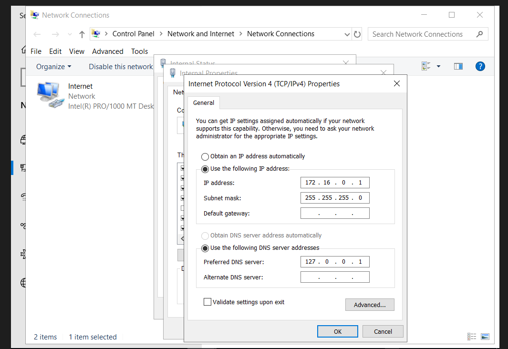

# Enterprise SOC Homelab

## Project Status

🚧 Project in progress

## Objective

Building an enterprise-style Security Operations Center (SOC) home lab to develop practical skills in:

- Active Directory
- Windows Security
- Sysmon
- Splunk
- Log Analysis
- Threat Detection
- Incident Response
- MITRE ATT&CK

## Environment

Currently building the Active Directory environment.

## Progress

- [x] GitHub repository created
- [x] Project documentation structure created
- [ ] Active Directory deployment
- [ ] Windows client configuration
- [ ] Sysmon deployment
- [ ] Splunk deployment
- [ ] Log forwarding
- [ ] Attack simulation
- [ ] Detection engineering
- [ ] Incident investigation

## 1. Configured internal network
### Result
Confugured internal network
### Evidence
  
 
