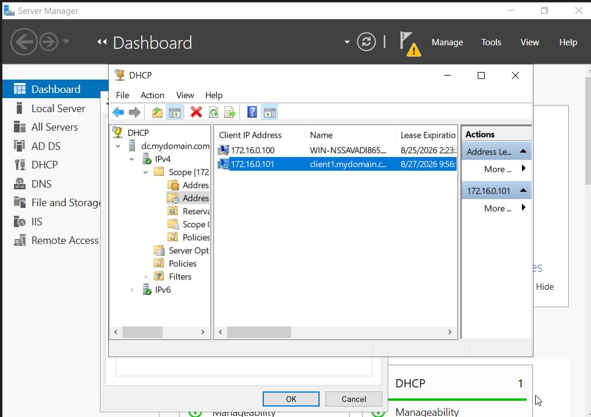
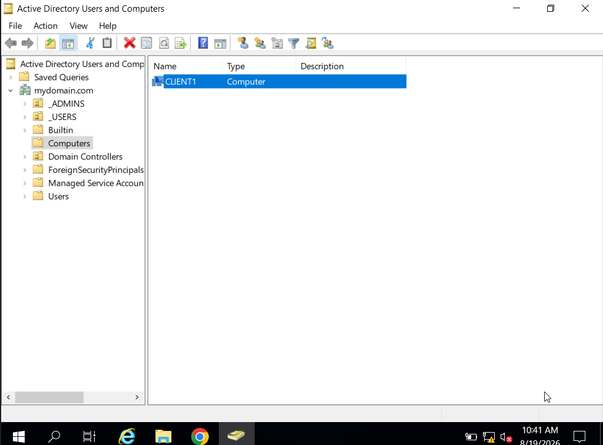

# Active Directory Enterprise Lab

## 1. Objective

The objective of this lab was to build a small enterprise-style Active Directory environment in a virtualized network.

The lab was designed to develop practical skills in:

- Active Directory Domain Services (AD DS)
- Windows Server administration
- Domain and user management
- Privileged account management
- DHCP and DNS
- Network Address Translation (NAT)
- Windows client domain joining
- PowerShell-based user management

This environment will later serve as the foundation for a SOC monitoring and detection lab using Sysmon and Splunk.

## 2. Lab Environment

The lab was built using Oracle VirtualBox to simulate a small enterprise Windows environment.

| Component | Role |
|---|---|
| Windows Server | Domain Controller / AD DS / DHCP / DNS / RAS |
| Windows Client | Domain-joined endpoint |
| Oracle VirtualBox | Virtualization platform |
| Active Directory | Centralized identity and access management |
| PowerShell | Bulk Active Directory user creation |

### Network

- Network type: Internal Network
- Domain: mydomain.com
- Domain Controller IP: 10.0.2.15
- Client IP: 172.16.0.1
- Subnet: 255.255.255.0

## 3. Network Architecture

The lab consists of a Windows Server acting as the Domain Controller and network services server, with a Windows client connected through an isolated internal network.

View Network Architecture

## 4. Implementation

4.1 Active Directory Domain Controller

Configured Windows Server as a Domain Controller and deployed Active Directory Domain Services (AD DS) for the lab domain.

**Key configuration:**
- Domain Controller: Windows Server
- Domain: mydomain.com
- IP Address: 10.0.2.15

View Evidence

### 4.2 Dedicated Domain Administrator Account
Created a dedicated administrative account inside a separate `_ADMINS` Organizational Unit and assigned it to the Domain Admins group.

This separates privileged administration from standard user accounts.

View Evidence

### 4.3 RAS and NAT
Configured Routing and Remote Access (RRAS) with NAT to provide internet connectivity for the internal lab network.

View Evidence

### 4.4 DHCP Configuration
Configured a DHCP scope for the internal lab network to automatically assign IP addresses to client machines.

View Evidence

### 4.5 Domain Controller Internet Access
Configured the Domain Controller to access the internet through the lab's network configuration.

View Evidence

### 4.6 Bulk Active Directory User Creation
Automated the creation of enterprise user accounts using a PowerShell script to simulate a realistic organizational structure with distinct Organizational Units (OUs), security groups, and tiered access levels.

View Evidence

### 4.7 Default Gateway Configuration
Configured IP routing and interface gateway settings to ensure internal subnet traffic properly routes through the virtual network perimeter interface.

View Evidence

### 4.8 Windows Client Domain Join
Joined the Windows client endpoint to the Active Directory domain, verifying proper DNS resolution, Kerberos authentication handshakes, and baseline Group Policy inheritance from the Domain Controller.

View Evidence

 
 .

## 5. Verification
* **DNS Resolution:** Verified bidirectional DNS name resolution between the Domain Controller and joined client endpoints via `nslookup`.
* **DHCP Lease Allocation:** Confirmed dynamic IPv4 address assignment and scope options (default gateway, DNS servers) on client interfaces.
* **Domain Authentication:** Successfully authenticated onto the workstation using provisioned Active Directory test accounts.

## 6. Security Relevance
* **Centralized Identity & Access Management (IAM):** Establishes the authoritative directory service required to enforce Least Privilege and Role-Based Access Control (RBAC).
* **High-Fidelity Log Source:** Domain Controllers generate critical Windows Security event logs (e.g., Event IDs 4624/4625 for logons, 4720 for user creation, 4672 for special privileges assigned) required for SIEM ingestion and SOC monitoring.
* **Simulated Attack Surface:** Creates a baseline enterprise target environment to later simulate and detect attacks such as Kerberoasting, AS-REP Roasting, and lateral movement.

## 7. Problems Encountered & Troubleshooting
* **DNS Resolution Failure During Domain Join:**
  * *Issue:* The client machine failed the domain join attempt because it defaulted to public DNS rather than the local Domain Controller.
  * *Resolution:* Statically configured the client network adapter's primary DNS to point directly to the Domain Controller IP address before re-attempting the join.
* **Internal Routing & NAT Isolation:**
  * *Issue:* The internal lab machines initially lacked internet access through the Domain Controller's routing interface.
  * *Resolution:* Reconfigured Routing and Remote Access (RRAS) NAT properties and verified internal switch mapping to route outbound traffic properly.

## 8. Lessons Learned
* **DNS is Fundamental to Active Directory:** Kerberos authentication and domain operations rely entirely on proper SRV records and domain DNS health.
* **Network Segmentation & Routing:** Setting up dual-homed routing (NAT via RRAS) reinforced the importance of isolating internal enterprise networks while managing controlled egress.
* **Automation Efficiency:** Leveraging scripts for bulk directory object creation eliminates configuration drift and scales administrative workflows.
