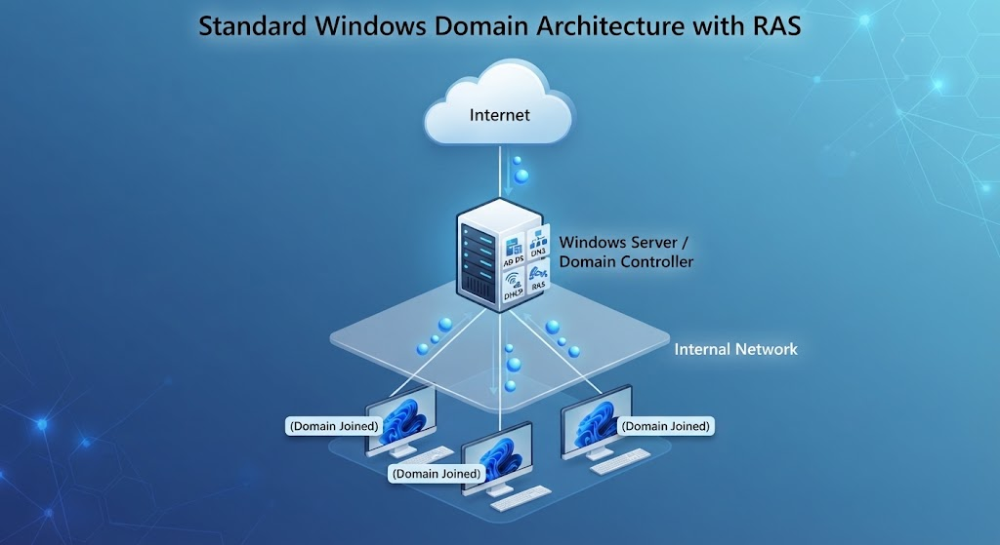
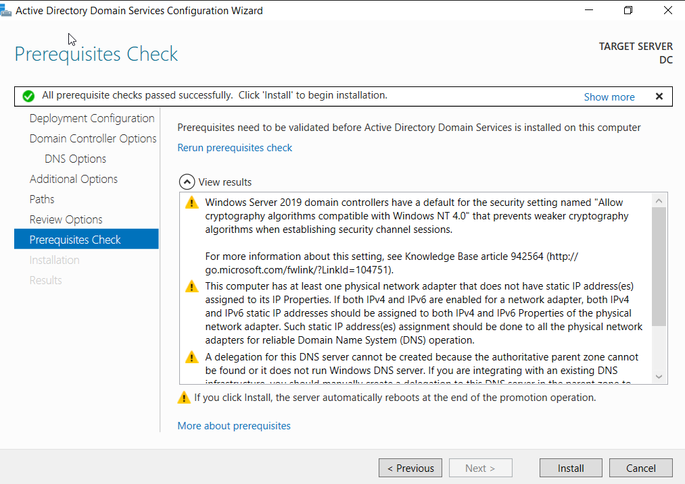
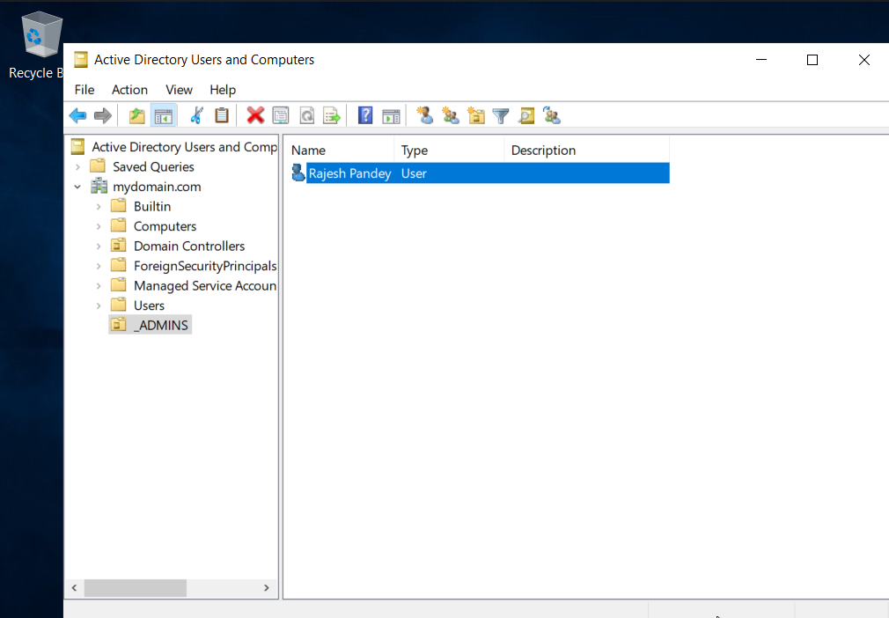
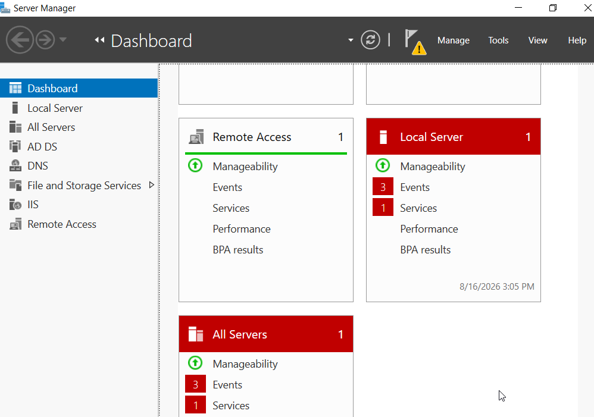
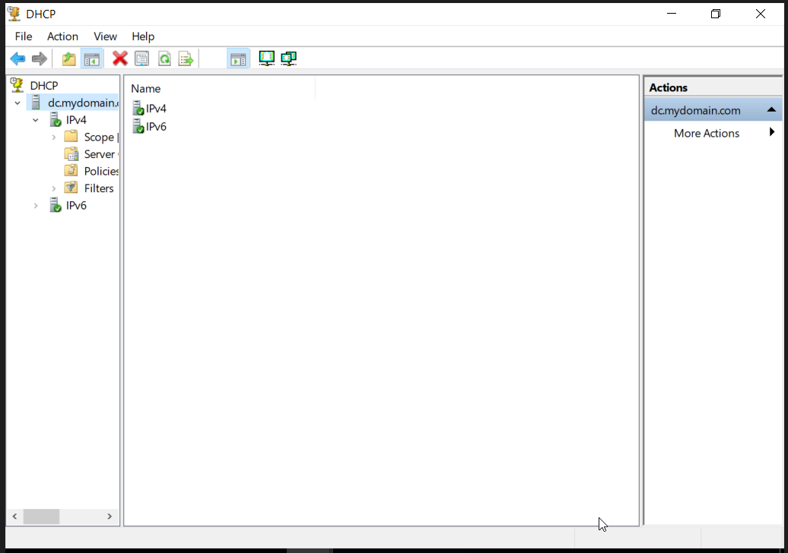
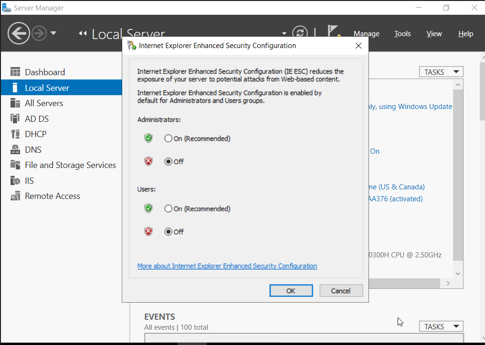
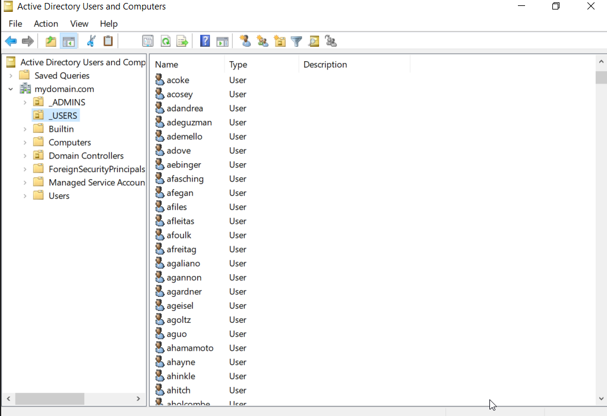
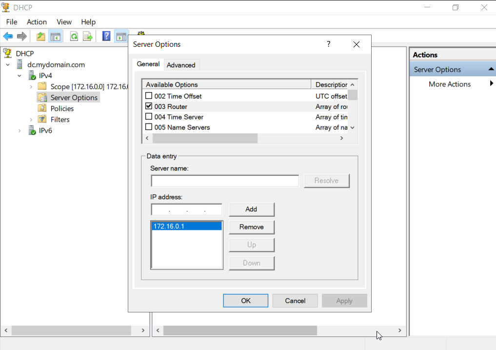

# Active Directory Enterprise Lab

## 1. Objective

The objective of this lab was to build a small enterprise-style Active Directory environment in a virtualized network.

The lab was designed to develop practical skills in:

- Active Directory Domain Services (AD DS)
- Windows Server administration
- Domain and user management
- Privileged account management
- DHCP and DNS
- Network Address Translation (NAT)
- Windows client domain joining
- PowerShell-based user management

This environment will later serve as the foundation for a SOC monitoring and detection lab using Sysmon and Splunk.

## 2. Lab Environment

The lab was built using Oracle VirtualBox to simulate a small enterprise Windows environment.

| Component | Role |
|---|---|
| Windows Server | Domain Controller / AD DS / DHCP / DNS / RAS |
| Windows Client | Domain-joined endpoint |
| Oracle VirtualBox | Virtualization platform |
| Active Directory | Centralized identity and access management |
| PowerShell | Bulk Active Directory user creation |

### Network

- Network type: Internal Network
- Domain: mydomain.com
- Domain Controller IP: 10.0.2.15
- Client IP: 172.16.0.1
- Subnet: 255.255.255.0

## 3. Network Architecture

The lab consists of a Windows Server acting as the Domain Controller and network services server, with a Windows client connected through an isolated internal network.

View Network Architecture

## 4. Implementation

4.1 Active Directory Domain Controller

Configured Windows Server as a Domain Controller and deployed Active Directory Domain Services (AD DS) for the lab domain.

**Key configuration:**
- Domain Controller: Windows Server
- Domain: mydomain.com
- IP Address: 10.0.2.15

View Evidence

### 4.2 Dedicated Domain Administrator Account
Created a dedicated administrative account inside a separate `_ADMINS` Organizational Unit and assigned it to the Domain Admins group.

This separates privileged administration from standard user accounts.

View Evidence

### 4.3 RAS and NAT
Configured Routing and Remote Access (RRAS) with NAT to provide internet connectivity for the internal lab network.

View Evidence

### 4.4 DHCP Configuration
Configured a DHCP scope for the internal lab network to automatically assign IP addresses to client machines.

View Evidence

### 4.5 Domain Controller Internet Access
Configured the Domain Controller to access the internet through the lab's network configuration.

View Evidence

### 4.6 Bulk Active Directory User Creation
Automated the creation of enterprise user accounts using a PowerShell script to simulate a realistic organizational structure with distinct Organizational Units (OUs), security groups, and tiered access levels.

View Evidence

### 4.7 Default Gateway Configuration
Configured IP routing and interface gateway settings to ensure internal subnet traffic properly routes through the virtual network perimeter interface.

View Evidence

### 4.8 Windows Client Domain Join

## 5. Verification

## 6. Security Relevance

## 7. Problems Encountered

## 8. Lessons Learned
